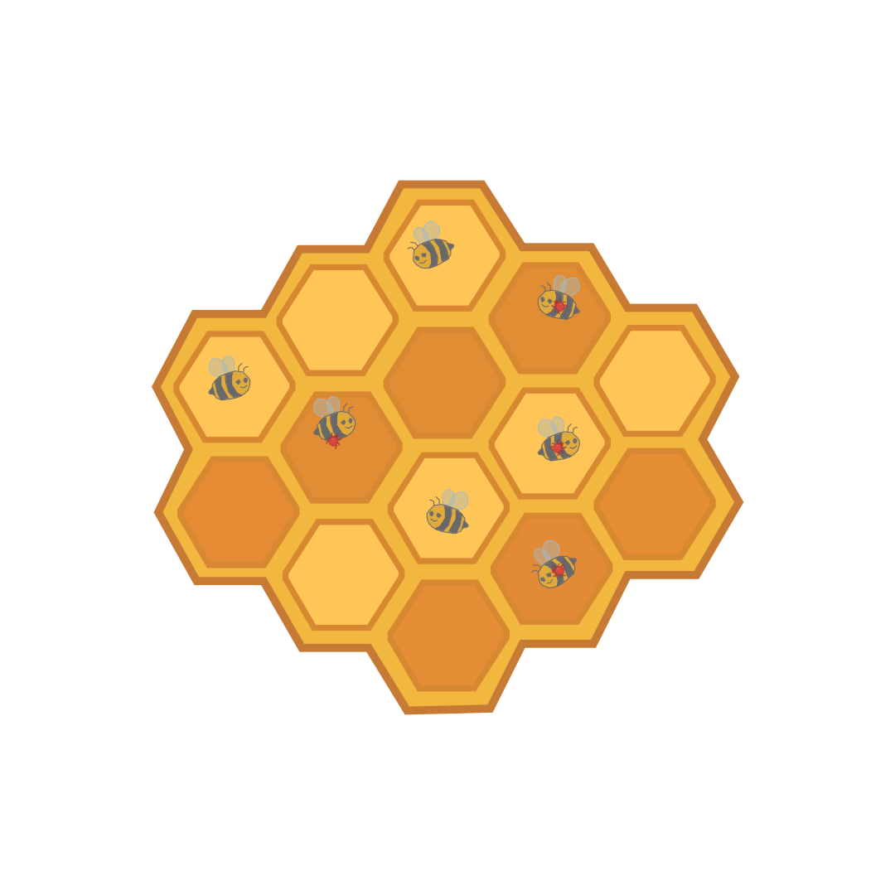
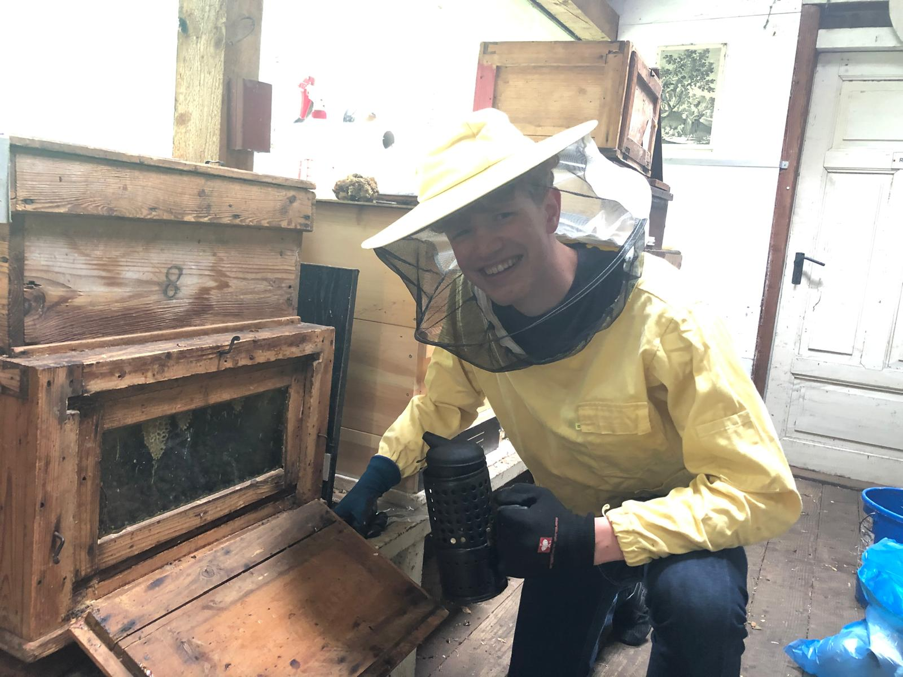

# Bee Wise 🐝🍯

Welcome to **Bee Wise**, an iOS app built for the **Apple Swift Student Challenge**. Bee Wise helps beekeepers detect Varroa mites using advanced computer vision and provides actionable health and treatment recommendations.

  

## Project Structure 📁

The workspace is organized into three major components:

1. **`BeeDetector.swiftpm`** 🧠
   - The standalone Swift Package Manager bundle containing the core computer vision and machine learning logic for detecting Varroa mites in images/video streams.
   
2. **`BeeWise`** 📱
   - The main iOS Application project built in Xcode. It provides an intuitive User Interface for beekeepers to run the computer vision tasks, manage their yards, and review colony condition over time.
   
3. **`Website`** 🌐
   - A promotional landing page built with standard HTML/CSS/JS that details the app's features and showcases the science behind the tool. Uses modern CSS animations.

## Key Features ✨

* **Instant Mite Detection**: Uses proprietary algorithms, precise color thresholding, saturation checks, and Hough Circle Transforms to detect reddish Varroa mites—even in complex backgrounds.
* **Smart Recommendations**: Based on Honey Bee Health Coalition guidelines, our engine evaluates mite ratios against queen age and bee breed.
* **Proactive Protection**: Identifies critical thresholds (e.g., >3% infestation) early. Tracks infestation levels over time to evaluate treatment efficacy.
* **Method Validation**: Works alongside established traditional methods like the sugar shake for verified results.

---

## The Story Behind Bee Wise

Beekeeping is an ancient art, but the threats facing modern hives require modern solutions. Created to bridge the gap between traditional apiculture and cutting-edge mobile technology, Bee Wise aims to automate the tedious and error-prone process of counting Varroa mites. By tackling the tedious tasks with tech, beekeepers can focus on what they do best: caring for their bees.

  

## Getting Started The App 🚀

1. Open `BeeWise/BeeWise.xcodeproj` in **Xcode**.
2. Select your deployment target (Simulator or physical iOS device).
3. Build and Run (`Cmd + R`).

If you'd like to test or review the standalone vision package, you can open `BeeDetector.swiftpm` directly in Xcode.
